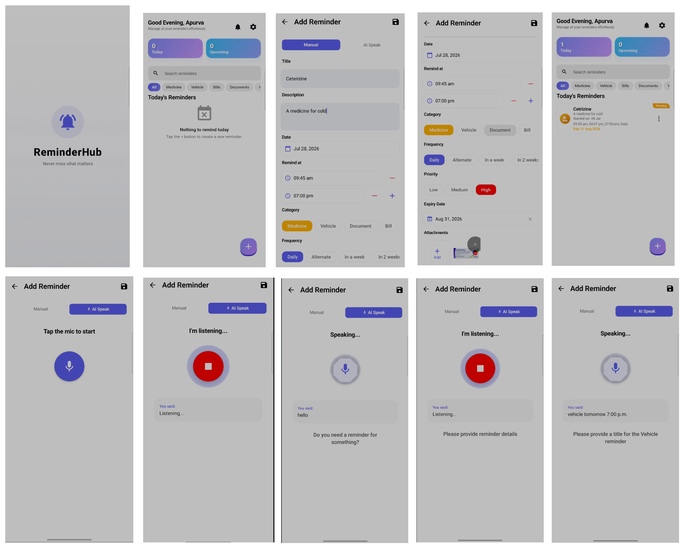
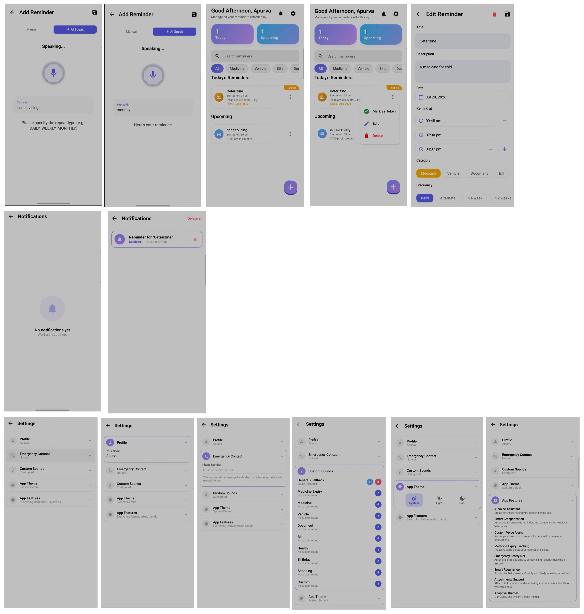
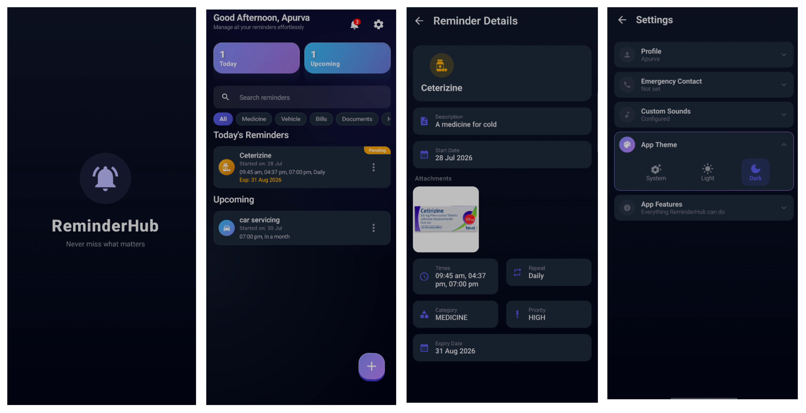
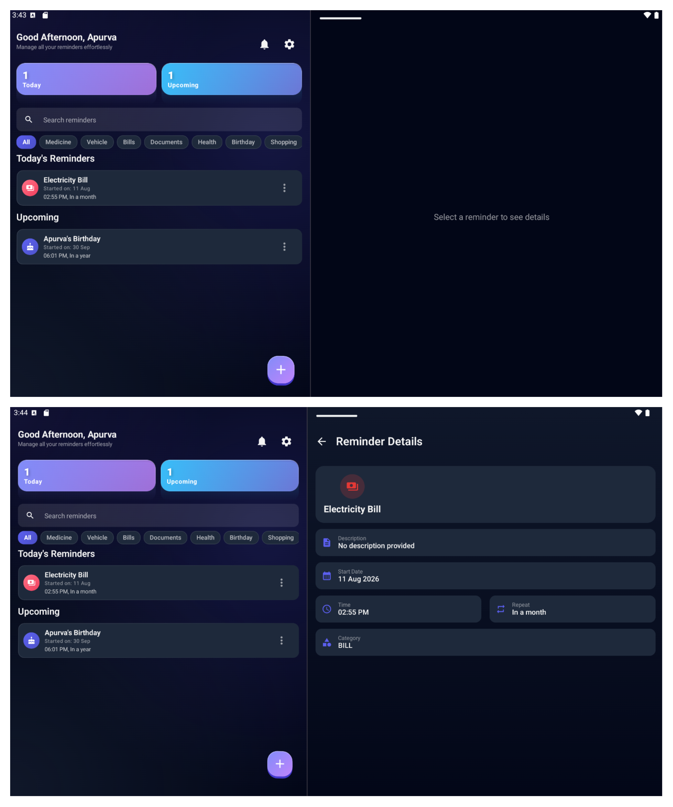
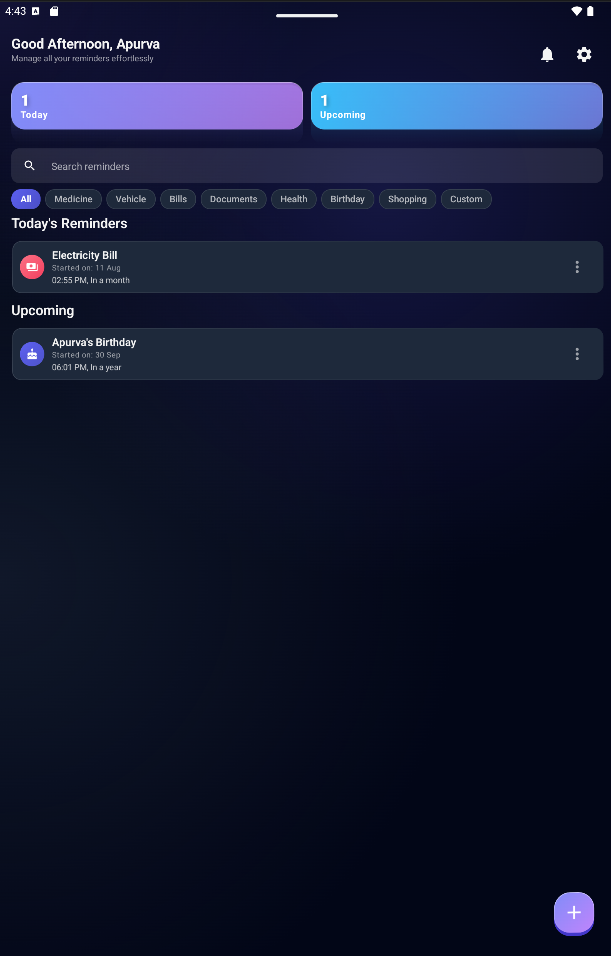

# ReminderHub 

**ReminderHub** is a smart, AI-powered personal assistant and reminder management application built for Android. It combines traditional task management with cutting-edge AI voice interaction and safety-first features for medicine tracking.

---

##  Key Features

###  AI Voice Assistant
- **Bilingual Support**: Fully supports **English**, **Hindi**, and **Hinglish**. The assistant intelligently detects and responds in the language you speak.
- **Natural Interaction**: Create reminders by simply talking to the app in your preferred language. 
- **Smart Parsing**: Powered by Groq AI, the assistant automatically identifies titles, categories, dates, and times from natural speech (English or Hindi).
- **Interactive Session**: The app talks back to you to confirm details or ask for missing information in the appropriate language.

###  Medicine & Safety First
- **Missed Dose Safety Net**: For high-priority medicine, the app tracks misses. If a reminder is ignored 3 times, it can automatically trigger an SMS or call to a pre-configured emergency contact.
- **Expiry Tracking**: Proactive alerts before your medications expire.
- **Status Badging**: Quick "Taken" or "Pending" status for daily medication directly on the home screen.

###  Advanced Organization
- **Smart Categorization**: Automatically organizes reminders into categories like Medicine, Bills, Documents, Vehicles, and more.
- **Rich Attachments**: Attach photos, documents, or media files directly to any reminder for quick access.
- **Flexible Recurrence**: Support for Daily, Weekly, Monthly, and Yearly repeating schedules.

###  Modern & Accessible UI
- **Adaptive Layouts**: Optimized for **Foldables** and **Tablets** using `WindowSizeClass`. The app dynamically switches between a single-pane and a list-detail dual-pane view.
- **Dynamic Theming**: Beautiful Light and Dark modes with optimized contrast.
- **Glassmorphic Elements**: Modern UI design with 3D-styled indicator spheres and glassmorphic cards.
- **Custom Sound Alerts**: Record your own voice or sounds for personalized category notifications.

---

##  Technology Stack

- **UI**: Jetpack Compose (100% Kotlin)
- **Adaptive Design**: Material 3 `WindowSizeClass` for multi-device support
- **Architecture**: Clean Architecture with MVVM
- **Dependency Injection**: Hilt
- **Database**: Room (Local caching & persistence)
- **AI/LLM**: Groq Cloud API for speech processing
- **Networking**: Retrofit & OkHttp
- **Asynchronous Work**: Kotlin Coroutines & Flow
- **Background Tasks**: WorkManager
- **Image Loading**: Coil
- **Animation**: Lottie & Compose Animations

---

##  Setup Instructions

### 1. API Keys
The app uses the Groq API for its AI features. 
1. Get your API key from [Groq Cloud](https://console.groq.com/).
2. Add the following line to your `local.properties` file:
   ```properties
   GROQ_API_KEY=your_api_key_here
   ```

### 2. Building for Release
If you intend to build a release APK, you should add your signing configurations to `local.properties` to keep them secure:
```properties
RELEASE_STORE_FILE=/path/to/your/key.jks
RELEASE_STORE_PASSWORD=your_password
RELEASE_KEY_ALIAS=your_alias
RELEASE_KEY_PASSWORD=your_key_password
```

---

## Preview







### Adaptive Tablet Layout (Landscape)


### Adaptive Tablet Layout (Portrait)



## Privacy & Permissions
- **Microphone**: Required for the AI Voice Assistant.
- **Notifications**: Essential for reminder alerts.
- **SMS/Phone**: Only used for the Emergency Safety Net feature if configured by the user.
- **Storage**: Required for attaching documents and media to reminders.

